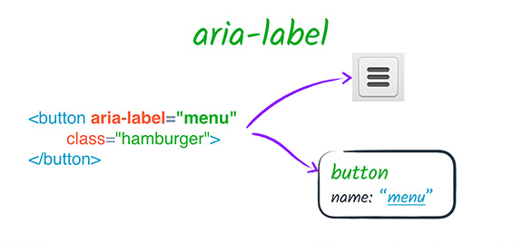
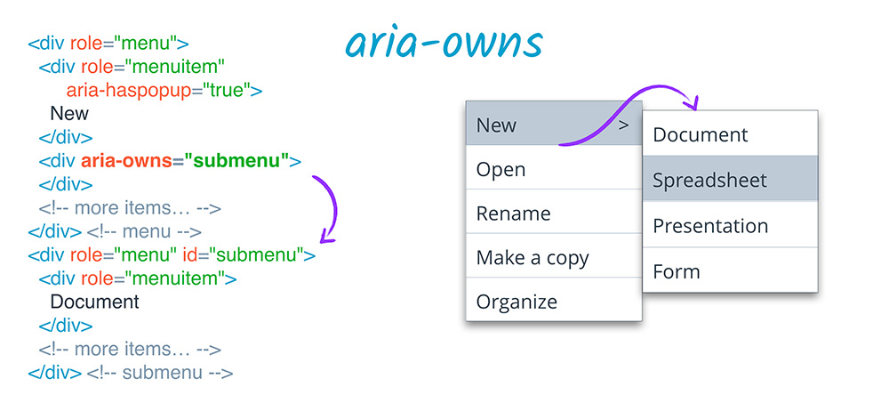

<!-- .slide: data-background="images/background/00.svg" -->

# Accessibility For Web Developers

<p class="author">
    Tao Zhang
</p>

<p id="slidesInfo">Dec , 2020 · Esri Beijing R&D Center</p>


---
<!-- .slide: data-background="images/background/01.svg" -->

## Topics

- Semantic HTML
- Keyboard and focus management
- ARIA
- A dev checklist
- Dev tools


---
<!-- .slide: data-background="images/background/01.svg" -->

<h2 class="centertitle">Semantics</h2>

The correct interpretation of the meaning of a word or sentence (code).


---
<!-- .slide: data-background="images/background/01.svg" -->

Don't do this

```html
<div id="header"></div>
<div class="section">
	<div class="article">
		<div class="figure">
			
			<div class="figcaption"></div>
		</div>
	</div>
</div>
<div id="footer"></div>
```
<hr>

Do this

```html
<header></header>
<section>
	<article>
		<figure>
			
			<figcaption></figcaption>
		</figure>
	</article>
</section>
<footer></footer>
```


---
<!-- .slide: data-background="images/background/01.svg" -->

## Why semantic HMTL

- Easier to read and understand
- Consistency in implementation
- Communicates content to assistive technology, reader modes, conversational UIs, search engines, and more


---
<!-- .slide: data-background="images/background/01.svg" -->

## Semantics in native HTML

- Most HTML elements have implicit semantics: role and state.
- Native HTML elements are recognized by browsers, and they work predictably on a variety of platforms.
- We should take advantage of built-in accessibility by writing HTML that expresses the semantics (intended purposes).


---
<!-- .slide: data-background="images/background/01.svg" -->

```html
<a href="https://www.esri.com">Esri Homepage</a>
```

- Role="link"
- Accessible name="Esri Homepage"
- State="focusable"


---
<!-- .slide: data-background="images/background/01.svg" -->

```html
<label>
    <input type="checkbox" checked>Working at Esri 
</label>
```

- Role="checkbox"
- Accessible name="Working at Esri"
- State="focusable checked"


---
<!-- .slide: data-background="images/background/01.svg" -->

## Some common semantic HTML elements

- `<ol>` and `<ul>`: items on the list are ordered/unordered 
- `<button>`: specify an action
- `<a>`: specify a change in location
- `<label>`: text capation for UI element


---
<!-- .slide: data-background="images/background/01.svg" -->

<h2 class="centertitle">Neutral semantics</h2>

Some HTML elements do not convey semantics (role or state)

```html
<div>This is a block area</div>
<span>This is an inline area</span>
```


---
<!-- .slide: data-background="images/background/01.svg" -->

If a semantic-neutral element is interactive, we need to do extra work:

- Make it focusable: `tabindex="0"`
- Receive keyboard events: <kbd>Enter</kbd>, <kbd>Space</kbd>, ...
- Name: explicit label (`label`) or implicit text (`aria-label`, `aria-labelledby`)


---
<!-- .slide: data-background="images/background/01.svg" -->

<h2 class="centertitle">Keyboard and focus management</h2>


---
<!-- .slide: data-background="images/background/01.svg" -->

<!-- <h2 class="centertitle">Keyboard</h2> -->

Interactive native HTML elements receive keyboard focus

<div><a href="#">Esri homepage</a><div>
<div><button>OK</button><div>
<div><input type="text" placeholder="john@example.com"><div>


---
<!-- .slide: data-background="images/background/01.svg" -->

Interactive elements have expected interactions

- Link: click, tap, or <kbd>Enter</kbd> key
- Button: click, tap, <kbd>Enter</kbd> key, or <kbd>Space</kbd> key
- Input: click, tap, or <kbd>Enter</kbd> key
- Checkbox: <kbd>Space</kbd> key


---
<!-- .slide: data-background="images/background/01.svg" -->

## Focusable elements

- Native interactive HTML elements are focusable:
  - Input fields
  - Buttons
  - Links
  - Select lists
- Not focusable:
  - Paragraphs
  - `div`s and `span`s
  - Headings


---
<!-- .slide: data-background="images/background/01.svg" -->

## Tabindex

- `tabindex="0"`: Let DOM structure determine focus order
- `tabindex="-1"`: Programmatically move focus
- Setting `tabindex` to a positive integer is anti-pattern


---
<!-- .slide: data-background="images/background/01.svg" -->

## Focus management patterns

- Bypass block
- Dropdown and menu
- Modal
- View change and delete
- Offscreen element


---
<!-- .slide: data-background="images/background/01.svg" -->

<h2 class="centertitle">Bypass block/Skip to content</h2>

Skip over repeated content on a page.
Example: [Calcite Web Documentation](https://esri.github.io/calcite-web/documentation/)


---
<!-- .slide: data-background="images/background/01.svg" -->

<h2 class="centertitle">Dropdown/menu</h2>

Use arrow keys and/or tab key to select an item.

Example: [Navigation menubar](https://www.w3.org/TR/wai-aria-practices-1.1/examples/menubar/menubar-1/menubar-1.html)


---
<!-- .slide: data-background="images/background/01.svg" -->

<h2 class="centertitle">Modal</h2>

Trap keyboard focus when the modal is open.

Example: [Modal dialog](https://www.w3.org/TR/wai-aria-practices-1.1/examples/dialog-modal/dialog.html)


---
<!-- .slide: data-background="images/background/01.svg" -->

<h2 class="centertitle">View change and delete</h2>

Keyboard focus is retained for the user to continue working.

Example: [To do list](https://codepen.io/heydon/pen/VpVNKW)


---
<!-- .slide: data-background="images/background/01.svg" -->

<h2 class="centertitle">Offscreen element</h2>

- Prevent the element from gaining focus when it's off screen
- Only allow it to be focused when the user can interact with it
- Set `display:none` or `visibility:hidden` when off screen
- Set `display:block` or `visibility:visible` before showing it to user

Example: [Calcite drawer pattern](http://esri.github.io/calcite-web/documentation/patterns/#drawers)


---
<!-- .slide: data-background="images/background/01.svg" -->

<h2 class="centertitle">ARIA</h2>
<p class="centerp">Accessible Rich Internet Applications </p>


---
<!-- .slide: data-background="images/background/01.svg" -->

## ARIA

- Specification for increasing accessibility of custom elements
- Allows developers to modify and augment *accessibility tree* from standard DOM


---
<!-- .slide: data-background="images/background/01.svg" -->

## Accessibility tree

<div class="twocol" style="height: 50%; width: 50%; margin:auto;">
    
    
</div>

<ul class="small">
    <li>Browser's responsibility to expose accessibility tree to assistive technologies.</li>
    <li>Shows how webpage is interpreted by assistive technologies and how accessible data are provided.</li>
    <li>Assistive technologies simulate and relay user interactions like click and key press to accessibility tree.</li>
</ul>

---
<!-- .slide: data-background="images/background/01.svg" -->

<h2 class="centertitle">Why do we need ARIA</h2>

Certain semantics and design patterns make it impossible to use native HTML semantics:

- a pop-up menu, no standard HTML element.
- a semantic characteristic "the user needs to know about this as soon as possible".


---
<!-- .slide: data-background="images/background/01.svg" -->

Example: Expose accessibility information for focusable element:

```jsx
<div tabIndex="0"          // focusable
     role="button"         // a button, not a div
     aria-label="Close">   // an accessible name
     onClick={clickHandler}
     onKeyDown={keydownHandler}> 
</div>
```


---
<!-- .slide: data-background="images/background/01.svg" -->

or just use a button:

```jsx
<button aria-label="Close"
        onClick={clickHandler}>   
</button>
```


---
<!-- .slide: data-background="images/background/01.svg" -->

ARIA doesn't augment any of the element's inherent behavior:

- Focusable
- Keyboard event listeners
- Custom behaviors still need to be implemented


---
<!-- .slide: data-background="images/background/01.svg" -->

As developers, we need to:

- Express the semantics of page correctly
- Specify accessible names and descriptions
- Make sure important elements have correct accessible roles, states, and properties


---
<!-- .slide: data-background="images/background/01.svg" -->

<h2 class="centertitle">ARIA attributes</h2>

| Roles     | Labels            | Relationships      |   |   |
|-----------|-------------------|--------------------|---|---|
| Landmarks | `aria-label`      | `aria-owns`        |   |   |
| Widgets   | `aria-labelledby` | `aria-describedby` |   |   |
|           |                   | `aria-controls`    |   |   |


---
<!-- .slide: data-background="images/background/01.svg" -->

## Roles

<p style="margin-left: 2.7em;">Landmarks: identify large content areas, used by screen readers for navigation, some have corresponding HTML elements.</p>

- `banner`: The main header of a page; typically assigned to a header element.
- `main`: the main content of a document.
- `navigation`: A collection of links for navigation.
- `contentinfo`: A collection of metadata, copyright information and the like.


---
<!-- .slide: data-background="images/background/01.svg" -->

## Roles

<p style="margin-left: 2.7em;">Widgets</p>

- `alert`
- `dialog`
- `data grid`
- `tab`
- `tablist`
- `tabpanel`


---
<!-- .slide: data-background="images/background/01.svg" -->

## Labels

<p style="margin-left: 2.7em;">`aria-label`</p>

- Specifies a string as accessible label
- Overrides native labeling


---
<!-- .slide: data-background="images/background/01.svg" -->

## Labels

<p style="margin-left: 2.7em;">`aria-labelledby`</p>

- Specifies `id` of another element in the DOM as label of current element
- Overrides all other name sources
- Could be used on any element, not just labelable elements
- Could take a list of `id`s
- Could specify visually hidden elements


---
<!-- .slide: data-background="images/background/01.svg" -->

## Relationships

<p style="margin-left: 2.7em;">`aria-owns`</p>

- Indicates an element should be treated as parent of another separate element in the DOM


---
<!-- .slide: data-background="images/background/01.svg" -->

## Relationships

<p style="margin-left: 2.7em;">`aria-describedby`</p>

- Provides an accessible description for an element
- References elements in the DOM separated from current element


---
<!-- .slide: data-background="images/background/01.svg" -->

## Relationships

<p style="margin-left: 2.7em;">`aria-controls`</p>

- Indicates an element "controls" another element in interaction


---
<!-- .slide: data-background="images/background/01.svg" -->

## ARIA use cases

- Label and description
- Relationship
- States
- Hide elements


---
<!-- .slide: data-background="images/background/01.svg" -->

<p class="centerp"><code>aria-label</code> example</p>

<div style="margin: auto;">
     
</div>


---
<!-- .slide: data-background="images/background/01.svg" -->

<p class="centerp"><code>aria-labelledby</code> example</p>

<div style="margin: auto;">
     
</div>


---
<!-- .slide: data-background="images/background/01.svg" -->

<p class="centerp"><code>aria-describedby</code> example</p>

<div style="margin: auto;">
     
</div>


---
<!-- .slide: data-background="images/background/01.svg" -->

<p class="centerp"><code>aria-controls</code> example</p>

```html
<div role="scrollbar" aria-controls="main"></div>
<div id="main">
  <!-- . . . -->
</div>
```


---
<!-- .slide: data-background="images/background/01.svg" -->

<p class="centerp"><code>aria-owns</code> example</p>

<div style="margin: auto;">
     
</div>


---
<!-- .slide: data-background="images/background/01.svg" -->

<p class="centerp"><code>aria-expanded</code> example</p>

```html
 <button aria-expanded="false" aria-controls="expandable-list-1">
     Expand List
 </button>
 <ul id="expandable-list-1">
     <li><a href="http://example.com">Sample Link</a></li>
     <li><a href="http://example.com">Sample Link 2</a></li>
     <li><a href="http://example.com">Sample Link 3</a></li>
 </ul>
 ```

 <p style="font-size: 0.6em; margin:auto;"><code>aria-controls</code> is needed here because the two elements are not parent and child.</p>


---
<!-- .slide: data-background="images/background/01.svg" -->

<p style="margin-left: 1.3em;">Elements explicitly hidden from the DOM will not be included in accessibility tree</p>

```css
[hidden] {
	display: none; /*not rendered, no space allocated */
}
[invisible] {
	visibility: hidden; /*rendered, space allocated*/
}
```


---
<!-- .slide: data-background="images/background/01.svg" -->

<p style="margin-left: 1.3em;">Elements not visually rendered but not explicitly hidden is still included in accessibility tree.</p>

```css
.screen-readers-only {
  border: 0;
  clip: rect(1px, 1px, 1px, 1px);
  clip-path: inset(50%);
  height: 1px;
  margin: -1px;
  overflow: hidden;
  padding: 0;
  position: absolute !important;
  width: 1px;
  word-wrap: normal !important;
}
```


---
<!-- .slide: data-background="images/background/01.svg" -->

## ARIA best practices

- Don't change native semantics, unless you really have to.
- All interactive elements must be usable with keyboard.
- Don't use `role="presentation"` or `aria-hidden="true"` on a visible and focusable element.
- All interactive elements must have an accessible label or name.


---
<!-- .slide: data-background="images/background/01.svg" -->

<h2 class="centertitle">A dev checklist</h2>


---
<!-- .slide: data-background="images/background/01.svg" -->

| Requirement   | Description   |
| ------------- | ------------- |
| Focusable     | Can you get to the element via keyboard?  |
| Operable      | Can you use the element with keyboard?    |
| Expected operation  | Does the element match [WAI-ARIA Authoring Practices](https://www.w3.org/TR/wai-aria-practices/)?    |
| Focus visible      | Can you see when the element has keyboard focus?   |
| Label      | Does the element have accessible text label?    |
| Role      | Does the element have appropriate ARIA role?   |
| States and properties      | Does the element have any ARIA states and properties to show UI changes?    |


---
<!-- .slide: data-background="images/background/01.svg" -->

## Text alternatives

- Every `` must have an `alt` attribute.
- Images that contain information or perform actions require descriptive `alt` text.
- The `alt` attribute should describe the information conveyed by the image, not the image itself.
- Decorative images should have empty `alt` text.


---
<!-- .slide: data-background="images/background/01.svg" -->

## Semantic HTML

- Tabular data should be in `<table>`.
- Headings are in `<h1>` - `<h6>` elements.
- Lists have list item (`<li>`) elements wrapped in `<ul>` or `<ol>` elements.
- Inputs (`<input>`) should always have a `<label>`, `aria-label`, or `aria-labelledby`.
- Set up ARIA [landmark roles](https://www.w3.org/TR/wai-aria/roles#landmark_roles).


---
<!-- .slide: data-background="images/background/01.svg" -->

## Tab order and focus

- Use `tabindex="0"` and let the natural DOM structure determine the keyboard tab order.
- Avoid jumping around keyboard focus
- Show clear focus indicator for interactive elements
- Do not set `outline:none` to focusable elements, unless using customized focus style


---
<!-- .slide: data-background="images/background/01.svg" -->

## Color

- Provide additional indication that does not rely on color perception
- Minimum color contrast ratio is **4.5** for normal text, 3 for larger text (at least 24 px or 19 px bold)


---
<!-- .slide: data-background="images/background/01.svg" -->

## Label

- Associate `label` with form control
- Avoid replacing visual label with placeholder text
- Use `aria-label`, `aria-labelledby`, and `aria-describedby` if needed


---
<!-- .slide: data-background="images/background/01.svg" -->

## Dev tools

- [WAI-ARIA Authoring Practices](https://www.w3.org/TR/wai-aria-practices-1.1/)
- Accessibility tab in Chrome DevTool
- [axe DevTools](https://www.deque.com/axe/devtools/)
- [axe-core/react](https://github.com/dequelabs/axe-core-npm/tree/develop/packages/react) and [eslint-plugin-jsx-a11y](https://www.npmjs.com/package/eslint-plugin-jsx-a11y)
- [Lighthouse CI](https://github.com/GoogleChrome/lighthouse-ci/blob/master/docs/getting-started.md)


---
<!-- .slide: data-background="images/background/02.svg" -->

### Questions?