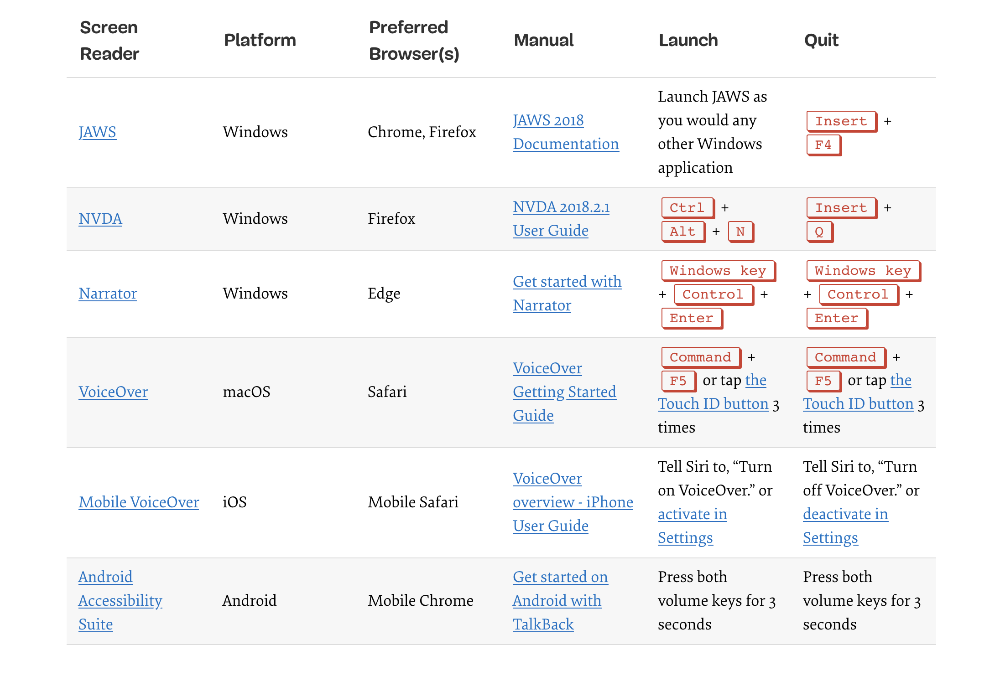

<!-- .slide: data-background="images/background/00.svg" -->

# Introduction to Accessibility Testing

<p class="author">
    Tao Zhang
</p>

<p id="slidesInfo">Dec , 2020 · Esri Beijing R&D Center</p>


---
<!-- .slide: data-background="images/background/01.svg" -->

## Why accessibility testing

- Accessibility is about the experience of all users
- Users using assistive technologies should have functionally equilvalent experience
- Testing is the only way to ensure the experience is accessible
- The goal is to verify how well web content functions as WCAG 2.0/2.1 specified


---
<!-- .slide: data-background="images/background/01.svg" -->

## Test process

1. Automated test
2. Keyboard test
3. Screen reader test
4. Color accessibility


---
<!-- .slide: data-background="images/background/01.svg" -->

## What to test

- Critical workflows
- Important pages
- UI components


---
<!-- .slide: data-background="images/background/01.svg" -->

## 1. Automated test with [aXe](https://www.deque.com/axe/)

- Tests rendered DOM
- Aims at no false positives
- Accessible
- Helpful documentation


---
<!-- .slide: data-background="images/background/01.svg" -->

- Automated test is good starting point but cannot detect all accessibility issues
- Run automated test of different page states (modals, accordions, tabs, etc.)


---
<!-- .slide: data-background="images/background/01.svg" -->

Use aXe to test an example app: [Land Tour](https://experience.arcgis.com/experience/84e6f1ecb86c4c34840d1c47b1794757/)


---
<!-- .slide: data-background="images/background/01.svg" -->

## 2. Keyboard test


---
<!-- .slide: data-background="images/background/01.svg" -->

## Expected outcomes (1/2)

- [2.1.1](https://www.w3.org/TR/UNDERSTANDING-WCAG20/keyboard-operation-keyboard-operable.html): Interact with all controls, links, and menus using only keyboard. 
- [2.4.7](https://www.w3.org/TR/UNDERSTANDING-WCAG20/navigation-mechanisms-focus-visible.html): See what item has focus at all times. 
- [2.4.3](https://www.w3.org/TR/UNDERSTANDING-WCAG20/navigation-mechanisms-focus-order.html): Visual focus order matches intended interaction order. 


---
<!-- .slide: data-background="images/background/01.svg" -->

## Expected outcomes (2/2)

- [2.1.2](https://www.w3.org/TR/UNDERSTANDING-WCAG20/keyboard-operation-trapping.html): No keyboard trap. 
- [2.4.1](https://www.w3.org/WAI/WCAG21/Understanding/bypass-blocks.html): Bypass blocks of content that are repeated on multiple pages. 
- Off-screen content (e.g., responsive navigation) should not receive focus when invisible. 


---
<!-- .slide: data-background="images/background/01.svg" -->

Use keyboard to test an example app: [Land Tour](https://experience.arcgis.com/experience/84e6f1ecb86c4c34840d1c47b1794757/)

(Remember to turn on key cast)


---
<!-- .slide: data-background="images/background/01.svg" -->

## Tools

- [Enhanced focus](https://pauljadam.com/demos/focusvisible.html)
- Live Expression in Chrome DevTools: `document.activeElement` ([source](https://developers.google.com/web/tools/chrome-devtools/accessibility/focus))
- Add this in the console: 
  ```javascript
  document.body.addEventListener('focusin', (event) => {
    console.log(document.activeElement)
  })
  ```


---
<!-- .slide: data-background="images/background/01.svg" -->

## 3. Screen reader test

<p style="margin-left: 2.5em;">Use screen readers to test the accessibility tree.</p>


---
<!-- .slide: data-background="images/background/01.svg" -->

<h2 class="centertitle">Screen reader commands</h2>




---
<!-- .slide: data-background="images/background/01.svg" -->

## Screen reader basics

- The *browse* and *tab* modes
- [Basic screen reader commands for accessibility testing](https://developer.paciellogroup.com/blog/2015/01/basic-screen-reader-commands-for-accessibility-testing/)
- [A11ycasts: VoiceOver](https://youtu.be/5R-6WvAihms)
- [A11ycasts: NVDA](https://youtu.be/Jao3s_CwdRU)


---
<!-- .slide: data-background="images/background/01.svg" -->

Use VoiceOver to test an example app: [Land Tour](https://experience.arcgis.com/experience/84e6f1ecb86c4c34840d1c47b1794757/)


---
<!-- .slide: data-background="images/background/01.svg" -->

## 3. Color accessibility test

- [1.4.1](https://www.w3.org/TR/UNDERSTANDING-WCAG20/visual-audio-contrast-without-color.html): Not use presentation that relies solely on color.
- [1.4.3](https://www.w3.org/TR/UNDERSTANDING-WCAG20/visual-audio-contrast-contrast.html): Color contrast ratio is at least 4.5:1.
- [1.4.11](https://www.w3.org/WAI/WCAG21/Understanding/non-text-contrast): UI components and graphics have at laeast 3:1 contrast against adjacent colors.


---
<!-- .slide: data-background="images/background/01.svg" -->

Test app: [Land Tour](https://experience.arcgis.com/experience/84e6f1ecb86c4c34840d1c47b1794757/)


---
<!-- .slide: data-background="images/background/01.svg" -->

## Tools

- [Chrome color picker & accessibility pane](https://developers.google.com/web/tools/chrome-devtools/accessibility/reference#pane)
- [Contrast ratio calculator](https://contrast-ratio.com/)


---
<!-- .slide: data-background="images/background/01.svg" -->

## Summary

- Start with automated test, then do keyboard, screen reader, and color test.
- Need to understand [WCAG Success Criteria](https://www.w3.org/TR/WCAG21/).
- Get familiar with [ARIA Best Practices](https://www.w3.org/TR/wai-aria-practices-1.1/).
- The ultimate decision-maker is the end user.


---
<!-- .slide: data-background="images/background/02.svg" -->

### Questions?